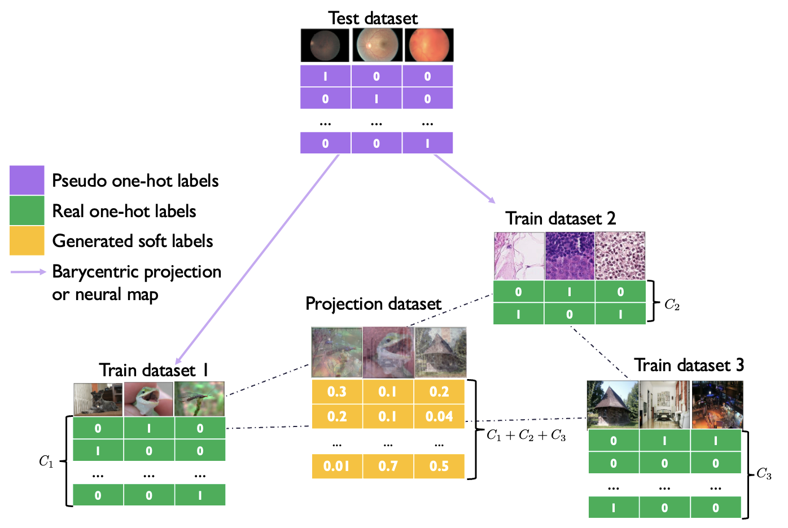

# Generating Synthetic Datasets by Interpolating along Generalized Geodesics

This is the official `Python` implementation of the [UAI 2023](https://www.auai.org/uai2023/) paper **Generating Synthetic Datasets by Interpolating along Generalized Geodesics** by [Jiaojiao Fan](https://sbyebss.github.io/) and [David Alvarez-Melis](https://dmelis.github.io/).

The repository contains reproducible `PyTorch` source code for few-shot transfer learning on \*NIST and [VTAB](https://github.com/google-research/task_adaptation) datasets.

<p align="center"></p>

## To reproduce results on dataset \*NIST

Please go to the folder `nist`, and refer to the README file there.

```bash
cd nist
```

## To reproduce results on dataset VTAB

Please go to the folder `vtab`, and refer to the README file there.

```bash
cd vtab
```

## Citation

If you find this repo useful for your research, please consider citing the paper

```
@article{fan2023generating,
  title={Generating synthetic datasets by interpolating along generalized geodesics},
  author={Fan, Jiaojiao and Alvarez-Melis, David},
  journal={arXiv preprint arXiv:2306.06866},
  year={2023}
}
```

For any questions, please contact Jiaojiao Fan (jiaojiaofan@gatech.edu).
